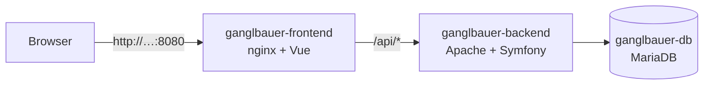

# Docker und Deployment

Die App besteht aus drei Containern. Lokal und auf einem Server laufen dieselben Container.



| Container | Inhalt | Von außen erreichbar |
|---|---|---|
| `ganglbauer-frontend` | nginx liefert die gebaute Vue-App aus und leitet `/api` weiter | ja, Port `HTTP_PORT` (Standard 8080) |
| `ganglbauer-backend` | Apache + PHP 8.4 + Symfony (Produktivmodus) | nein |
| `ganglbauer-db` | MariaDB 11, Daten im Volume `db-data` | nein |

Alle drei laufen unter dem Projektnamen **ganglbauer** und erscheinen in Docker Desktop
gruppiert.

## Lokal starten

```bash
cd docker
cp .env.example .env      # einmalig – Passwörter und ersten Chef eintragen
docker compose up -d --build
```

Beim ersten Mal dauert der Build ein paar Minuten. Danach:

- **App:** http://localhost:8080
- **Anmelden** mit `ADMIN_EMAIL` / `ADMIN_PASSWORD` aus der `.env`. Dieser Chef wird beim
  ersten Start automatisch angelegt.

Nützliche Befehle (im Ordner `docker/`):

```bash
docker compose ps                  # Status aller Container (healthy = bereit)
docker compose logs -f backend     # Logs des Backends mitlesen
docker compose up -d --build       # nach Code-Änderungen neu bauen und starten
docker compose down                # stoppen (Daten bleiben erhalten)
docker compose down -v             # stoppen UND Datenbank löschen
```

Beim Start des Backends passiert automatisch (`backend-entrypoint.sh`):

1. JWT-Schlüssel anlegen, nur beim ersten Mal, sie liegen im Volume `jwt-keys`
2. Datenbankschema auf den aktuellen Stand bringen
3. ersten Chef anlegen, falls es ihn noch nicht gibt
4. Cache aufwärmen

Das Frontend startet erst, wenn das Backend antwortet, und das Backend erst, wenn die
Datenbank bereit ist (Healthchecks).

## Auf einen Webserver bringen

Voraussetzung: ein Linux-Server mit Docker und dem Compose-Plugin.

```bash
git clone https://github.com/number1fragger/ganglbauer_zeitmanagment.git
cd ganglbauer_zeitmanagment/docker
cp .env.example .env
nano .env                         # sichere Passwörter setzen (siehe unten)
docker compose up -d --build
```

**Sichere Werte** für `APP_SECRET`, `JWT_PASSPHRASE` und die Datenbank-Passwörter erzeugen:

```bash
openssl rand -hex 32
```

### HTTPS

Die Container sprechen nur HTTP. Für den Betrieb im Internet gehört davor ein Webserver
mit Zertifikat, der auf `http://127.0.0.1:8080` weiterleitet. Mit **Caddy** holt er sich das
Zertifikat von Let's Encrypt selbst, die ganze Konfiguration (`/etc/caddy/Caddyfile`) ist:

```
werkstatt.example.at {
    reverse_proxy 127.0.0.1:8080
}
```

Damit die App dann nicht zusätzlich ohne HTTPS erreichbar ist, in `docker-compose.yml`
den Port nur lokal freigeben: `'127.0.0.1:${HTTP_PORT:-8080}:80'`.

### Updates einspielen

```bash
git pull
cd docker
docker compose up -d --build
```

Das Datenbankschema wird beim Start automatisch angepasst.

### Datensicherung

```bash
# Sichern
docker compose exec db sh -c 'mariadb-dump -u root -p"$MARIADB_ROOT_PASSWORD" "$MARIADB_DATABASE"' > sicherung.sql

# Wiederherstellen
docker compose exec -T db sh -c 'mariadb -u root -p"$MARIADB_ROOT_PASSWORD" "$MARIADB_DATABASE"' < sicherung.sql
```

## Worauf geachtet wurde

- **Zeitzone:** Container laufen sonst in UTC, dann würde der Arbeitstag um 09:00 statt
  07:00 beginnen. `APP_TIMEZONE` stellt das ein, Standard ist `Europe/Vienna`.
- **Login-Token:** Apache verwirft ohne Zusatzzeile den `Authorization`-Header, dann
  wäre jede Anfrage nach dem Login ein 401. Das `SetEnvIf` im Backend-Image behebt das.
- **Zugangsdaten** stehen nur in `docker/.env`, und die ist nicht im Git.
  Fehlt ein Pflichtwert, bricht `docker compose` mit einer klaren Meldung ab.
- **Produktivmodus:** keine Demodaten, keine Entwicklungspakete, Fehlermeldungen ohne
  interne Details.
- **Caching:** Die gebauten JS/CSS-Dateien haben einen Hash im Namen und werden ein Jahr
  gecacht. `index.html` wird immer neu geladen, damit Updates sofort ankommen.
