# Projektdokumentation – Ganglbauer Zeitmanagement

Werkstatt-Planung für Ganglbauer Landtechnik: Arbeiten einplanen, Zeiten erfassen und
auf einen Blick sehen, wer wann wieder neue Arbeit braucht.

**Inhalt**

1. [Ausgangslage und Ziel](#1-ausgangslage-und-ziel)
2. [Anforderungen und Umsetzung](#2-anforderungen-und-umsetzung)
3. [Rollen und Rechte](#3-rollen-und-rechte)
4. [Bedienung](#4-bedienung)
5. [Technik und Architektur](#5-technik-und-architektur)
6. [Datenmodell](#6-datenmodell)
7. [Wichtige Abläufe](#7-wichtige-abläufe)
8. [API-Referenz](#8-api-referenz)
9. [Installation und Entwicklung](#9-installation-und-entwicklung)
10. [Tests](#10-tests)
11. [Entscheidungen, Grenzen und Ausblick](#11-entscheidungen-grenzen-und-ausblick)

---

## 1. Ausgangslage und Ziel

Bisher musste die Werkstattleitung jeden Arbeiter einzeln fragen, wie lange er noch
beschäftigt ist, bevor sie einen Kundentermin vereinbaren konnte. Die App ersetzt diese
Rundfrage: Beim Öffnen sieht der Chef sofort, **wer wann wieder frei ist**, und kann
Kunden gezielt für diesen Zeitpunkt einplanen.

Die vollständige Aufgabenstellung steht in [`Angabe.md`](../Angabe.md).

## 2. Anforderungen und Umsetzung

| Nr. | Anforderung | Umsetzung |
|---|---|---|
| F1 | Arbeiten anlegen, geplante Zeit festlegen | Dialog „Arbeit anlegen“ mit Stepper für die Stunden (`JobController::create`) |
| F2 | Prioritäten vergeben | Hoch / Mittel / Nieder, farbig in allen Ansichten |
| F3 | Arbeitsbeginn und -ende festlegen | Felder im Dialog; im Kalender per **Drag & Drop** verschiebbar |
| F4 | Erledigte Arbeiten abhaken | Häkchen im Dialog, Kreis-Knopf in der Arbeiter-Ansicht |
| F5 | Arbeitszeit erhöhen | Knopf „+ 1 Stunde“; die ursprüngliche Planung bleibt für die Auswertung erhalten |
| F6 | Meldung bei Zeitüberschreitung | Rote Markierung „!“, Warnliste in der Tagesansicht |
| F7 | Button „Brauche Arbeit“ | Arbeiter-Ansicht: „Morgen früh“, „Morgen Nachmittag“, „Übermorgen früh“ |
| F8 | Erst einen Tag vorher möglich | Frühestens für den nächsten Kalendertag, im Backend geprüft (`WorkRequest::validateLeadTime`) |
| F9 | Übersicht über das Ende der Arbeiten | Seitenleiste „Kapazität“, „frei ab …“ in jeder Spalte, Auslastung in der Auswertung |
| A1 | Geplante vs. tatsächliche Zeit je Arbeiter | Auswertung mit Kennzahlen, Balken und CSV-Export |

## 3. Rollen und Rechte

| | Chef | Vorarbeiter | Arbeiter |
|---|:-:|:-:|:-:|
| Kalender (Tag / Woche / Monat), Drag & Drop | ✓ | ✓ | – |
| Arbeiten anlegen, bearbeiten, zuteilen, löschen | ✓ | ✓ | – |
| Eigene Arbeiten: Zeit erfassen, verlängern, abhaken | ✓ | ✓ | ✓ |
| „Brauche Arbeit“ melden | ✓ | ✓ | ✓ |
| Anfragen zuteilen, Auswertung | ✓ | ✓ | – |
| Benutzer & Rechte | ✓ | – | – |

Die Rollen bauen aufeinander auf (`role_hierarchy` in `security.yaml`):
`ROLE_ADMIN` (Chef) → `ROLE_FOREMAN` (Vorarbeiter) → `ROLE_USER` (Arbeiter).

**Die Rechte prüft das Backend.** Das Frontend blendet Seiten nur aus. Wer die API direkt
aufruft, bekommt trotzdem `403`. Die feinen Regeln („ein Arbeiter darf nur die eigene
Arbeit abhaken“) stehen im `JobVoter`.

Der Chef erscheint im Kalender nur, wenn ihm selbst gerade eine offene Arbeit zugeteilt
ist, sonst stünde er dauerhaft als „frei“ in der Kapazitätsliste.

## 4. Bedienung

### 4.1 Chef und Vorarbeiter

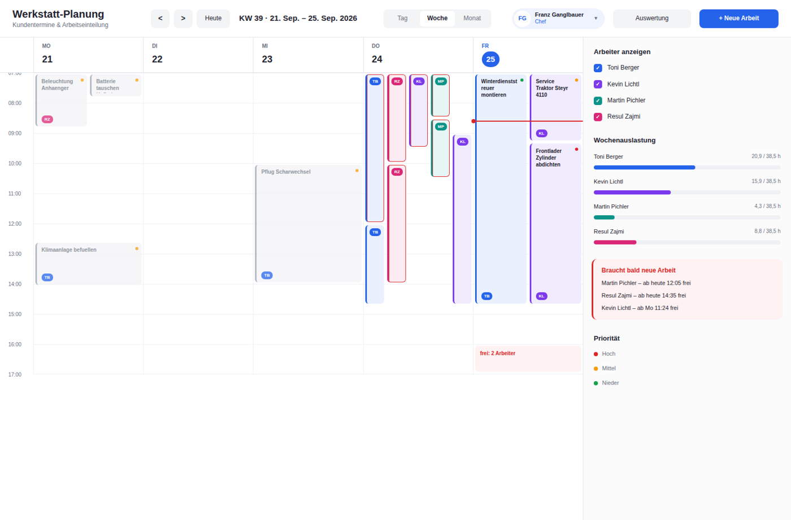

**Kalender.** Oben lässt sich zwischen **Tag**, **Woche** und **Monat** umschalten.

- **Tag:** jeder Arbeiter eine Spalte. Die Farbe links an der Karte zeigt die Priorität.
  Rechts stehen Kapazität, offene Anfragen und Warnungen.
- **Woche:** Montag bis Freitag, jeder Arbeiter in seiner eigenen Farbe mit Kürzel.
  „frei: 2 Arbeiter“ zeigt freie Kapazität am Tagesende.
- **Monat:** Überblick, wo noch Platz für Kundentermine ist. Ein Klick auf einen Tag
  öffnet die Tagesansicht.

**Arbeit anlegen:** „+ Neue Arbeit“ oder direkt auf eine freie Stelle im Kalender klicken,
dann sind Arbeiter und Uhrzeit schon ausgefüllt.

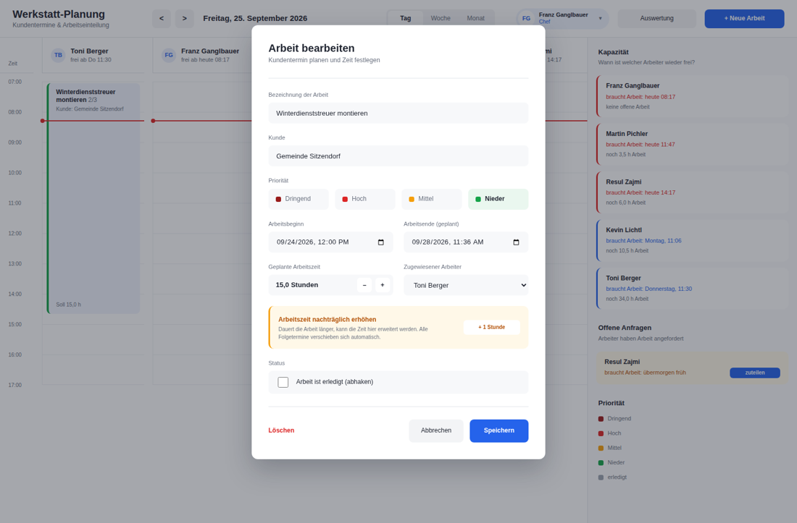

**Verschieben per Drag & Drop:** eine Karte anfassen und an die neue Stelle ziehen. Die
Uhrzeit rastet auf 15 Minuten ein, eine gestrichelte Vorschau zeigt das Ziel.

- In der **Tagesansicht** kann man die Arbeit auch zu einem anderen Arbeiter ziehen.
- In der **Wochenansicht** auf einen anderen Tag oder eine andere Uhrzeit.
- In der **Monatsansicht** auf einen anderen Tag, die Uhrzeit bleibt gleich.

Danach erscheint unten ein Hinweis mit **Rückgängig**. Erledigte Arbeiten lassen sich nicht
verschieben.

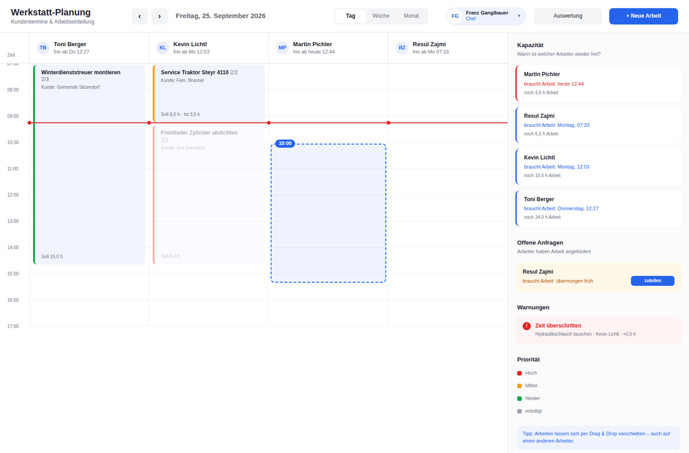

**Anfrage zuteilen:** Bei „Offene Anfragen“ auf **zuteilen** klicken. Der Dialog öffnet sich
mit Arbeiter und Zeitpunkt, nach dem Speichern gilt die Anfrage als erledigt.

**Auswertung:** Kennzahlen, Soll/Ist je Arbeiter, größte Abweichungen und die Auslastung.
Über „CSV exportieren“ lassen sich die Daten in Excel öffnen.

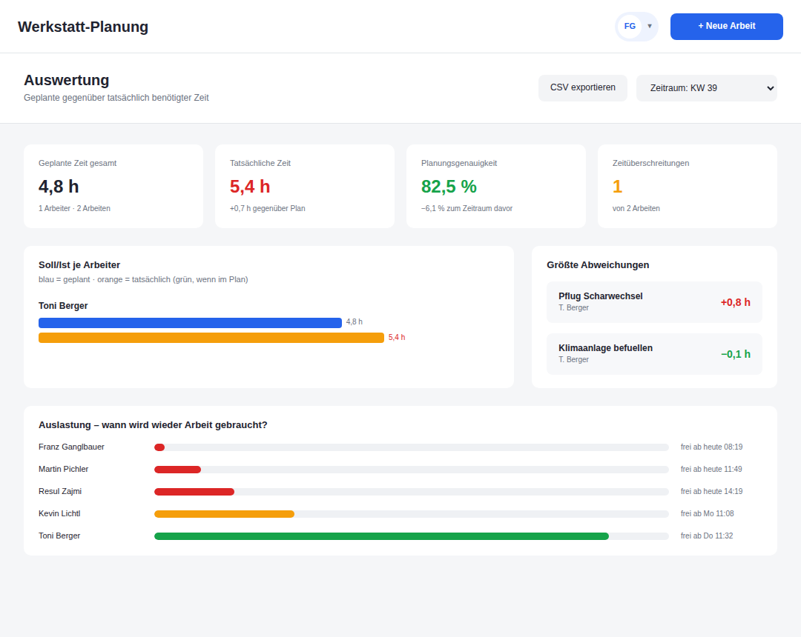

**Benutzer & Rechte (nur Chef):** Benutzer anlegen, Rolle über die farbige Pille ändern.
Über „⋯“ lassen sich Wochenstunden ändern, das Passwort zurücksetzen und Konten
deaktivieren. Deaktivierte Benutzer können sich nicht mehr anmelden.

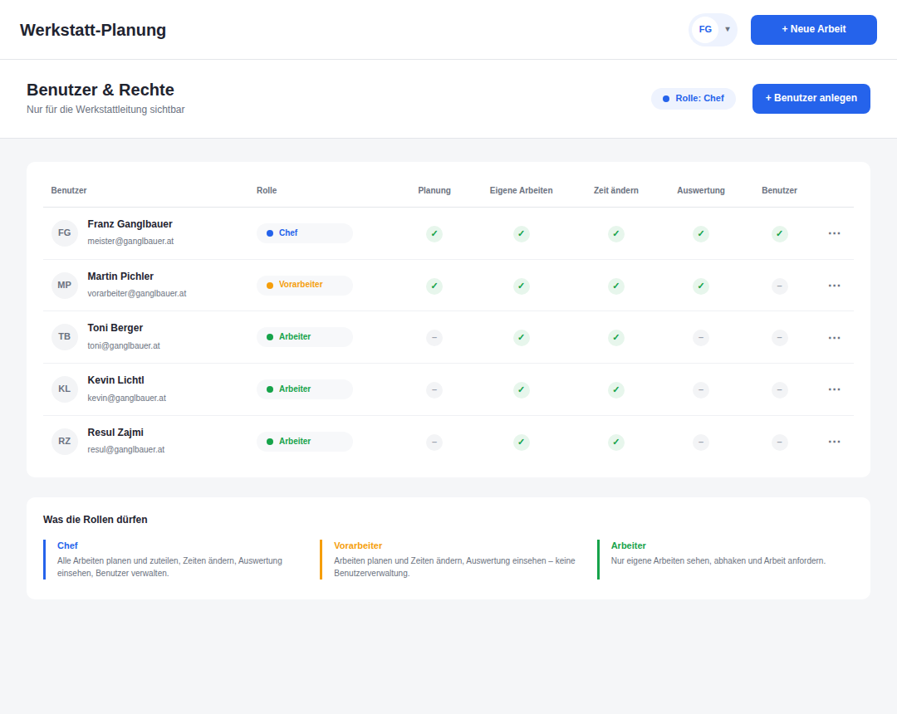

### 4.2 Arbeiter (Handy)

| Kalender (Chef) | Arbeit anlegen | Arbeiter-Ansicht |
|---|---|---|
| 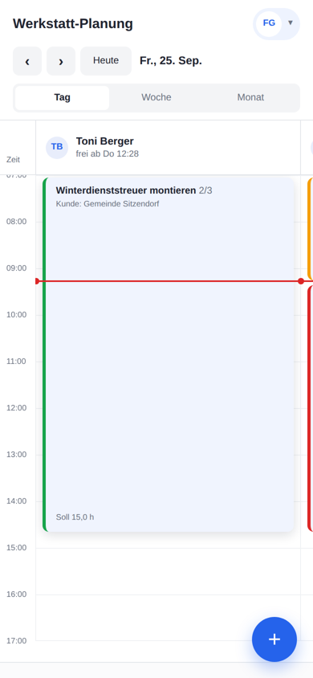 | 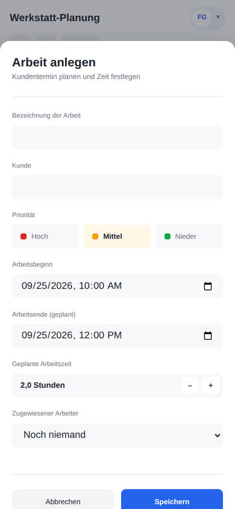 | 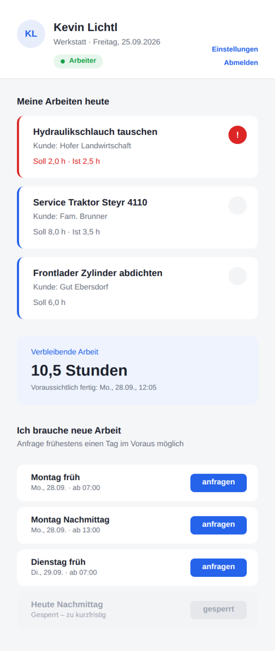 |

- **Meine Arbeiten heute:** Antippen zeigt „Zeit starten“, „+ 1 Stunde“ und „Erledigt“.
  Der Kreis rechts hakt die Arbeit direkt ab.
- **Verbleibende Arbeit:** Restzeit und voraussichtliches Ende.
- **Ich brauche neue Arbeit:** Zeitpunkt antippen. Heute ist gesperrt, frühestens der
  nächste Werktag. Ein zweites Tippen zieht die Anfrage zurück.

Am Handy funktioniert auch der Kalender: Man wischt seitlich von Arbeiter zu Arbeiter.
**Verschieben geht mit kurzem Gedrückthalten**, damit normales Wischen weiter scrollt.
„+ Neue Arbeit“ ist der runde Knopf unten rechts.

## 5. Technik und Architektur

| Bereich | Technik | Warum |
|---|---|---|
| Backend | Symfony 7.4, PHP 8.4, Doctrine ORM | Standard für PHP-APIs, Validierung und Security eingebaut |
| Login | JWT (LexikJWTAuthenticationBundle) | Zustandslos, passt zu einer Single-Page-App |
| Datenbank | MariaDB 11 | Vorgabe; läuft in Docker |
| Frontend | Vue 3 (Composition API, `<script setup>`), Vue Router, Pinia | Offizieller Vue-Standard |
| Build | Vite | Standard-Werkzeug für Vue |
| Code-Qualität | ESLint, Prettier, PHPUnit | Einheitlicher Stil, automatische Tests |

Bewusst **ohne** zusätzliche Bibliotheken: kein axios (`fetch` reicht), keine
Drag-&-Drop-Bibliothek (Pointer Events), keine UI-Bibliothek (eigene CSS-Variablen aus dem
Figma-Entwurf), kein TypeScript.

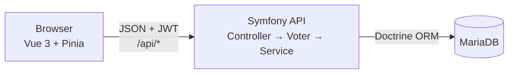

### Projektstruktur

```
backend/
  src/
    Controller/Api/     REST-Endpunkte (je Ressource ein Controller)
    Entity/             Job, User, TimeEntry, WorkRequest
    Enum/               Priority, JobStatus, UserRole, WorkRequestStatus
    Repository/         Datenbankabfragen
    Security/           JobVoter (Rechte je Arbeit), UserChecker (deaktivierte Konten)
    Service/            WorkloadCalculator, CalendarBuilder, OverviewBuilder, TimeTracker
    DataFixtures/       Demodaten (nur dev/test)
  tests/Unit/           PHPUnit-Tests
frontend/
  src/
    api/client.js       fetch-Wrapper: JWT, JSON, deutsche Fehlermeldungen
    stores/             auth (Anmeldung, Rolle), jobDialog (globaler Dialog)
    router/             Routen mit Mindestrolle (meta.role)
    composables/        useDrag – Drag & Drop mit Maus und Finger
    components/         AppHeader, JobDialog, calendar/TimeGrid, calendar/MonthGrid
    views/              eine Datei pro Seite
    utils/              Datums- und Formatierungshilfen
    assets/main.css     Design-Tokens aus Figma, Grundstile
docker/                 Kompletter Stack (MariaDB, Symfony, nginx)
docs/                   Diese Dokumentation
```

## 6. Datenmodell

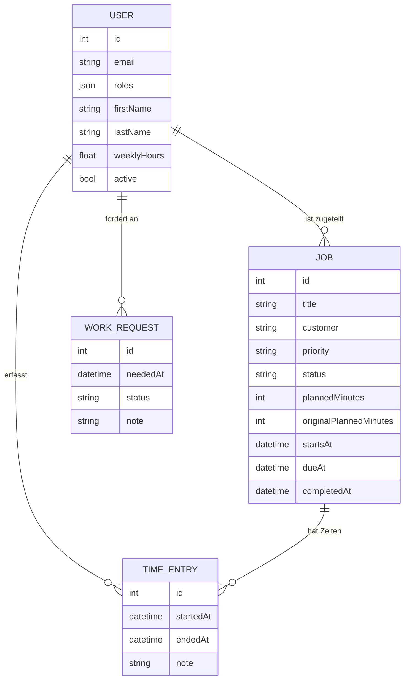

- **Soll** einer Arbeit ist `plannedMinutes`, **Ist** ist die Summe ihrer Zeiteinträge.
- `originalPlannedMinutes` bleibt beim Verlängern (F5) unverändert, so sieht die Auswertung,
  wie gut ursprünglich geplant wurde.

## 7. Wichtige Abläufe

### 7.1 Arbeitszeit und „frei ab“

`WorkloadCalculator` rechnet mit Werktagen (Mo–Fr) ab 07:00 und der täglichen Arbeitszeit
des Arbeiters (Wochenstunden ÷ 5, bei 38,5 h also 7:42 h, Tagesende 14:42 Uhr).

- `estimateAvailableFrom()`: offene Restminuten → Zeitpunkt „wieder frei“.
- `splitIntoWorkingBlocks()`: legt eine Arbeit auf die Arbeitstage. Eine Arbeit von 8 h ab
  Mittwoch 13:00 wird zu „Mi 13:00–14:42“ und „Do 07:00–13:18“. Daraus zeichnet der
  Kalender die Karten („Teil 1/2“).

Ist eine Arbeit schon überzogen, zählt im Kalender die tatsächliche Zeit, sonst würde der
Arbeiter zu früh als frei angezeigt.

### 7.2 Drag & Drop

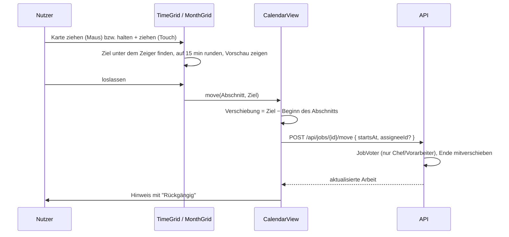

Die ganze Arbeit wird um denselben Betrag verschoben, auch wenn man den zweiten Teil
einer mehrtägigen Arbeit zieht. Das Backend legt sie danach neu auf die Arbeitszeit.

`useDrag` nutzt **Pointer Events**, die Maus und Touch gleich behandeln:

- Maus: Ziehen beginnt nach 6 px Bewegung, sonst ist es ein Klick.
- Touch: Ziehen erst nach 350 ms Halten. Bewegt sich der Finger vorher, scrollt die Seite ganz normal.

### 7.3 „Brauche Arbeit“ (F7/F8)

Ein Arbeiter hat höchstens eine offene Anfrage, eine neue ersetzt die alte. Erlaubt ist
frühestens der **nächste Kalendertag** (nicht „24 Stunden“), damit „morgen früh“ auch
nachmittags noch geht. Die Regel steht einmal im Backend (`WorkRequest::validateLeadTime`),
das Frontend zeigt „heute“ nur als gesperrt an.

## 8. API-Referenz

Alle Pfade außer Login und Health brauchen den Header `Authorization: Bearer <token>`.
Fehler kommen immer als JSON: `{ "title": "…", "errors": [{ "field", "message" }] }`.

| Methode | Pfad | Wer | Zweck |
|---|---|---|---|
| POST | `/api/login` | alle | `{ email, password }` → `{ token }` |
| GET | `/api/health` | alle | Lebenszeichen |
| GET / PATCH | `/api/me` | angemeldet | eigenes Profil |
| PUT | `/api/me/password` | angemeldet | Passwort ändern |
| GET | `/api/me/workload` | angemeldet | eigene Restzeit und „frei ab“ |
| GET | `/api/calendar?from=&to=` | angemeldet¹ | Kalenderabschnitte, höchstens 45 Tage |
| GET | `/api/jobs` | angemeldet¹ | Arbeiten (`assignee`, `status`, `includeDone`) |
| GET | `/api/jobs/{id}` | Voter | eine Arbeit |
| POST | `/api/jobs` | Chef, Vorarbeiter | anlegen |
| PATCH | `/api/jobs/{id}` | Chef, Vorarbeiter | bearbeiten |
| POST | `/api/jobs/{id}/move` | Chef, Vorarbeiter | verschieben (Drag & Drop) |
| POST | `/api/jobs/{id}/extend` | Voter² | `{ minutes }` verlängern |
| POST | `/api/jobs/{id}/complete` | Voter² | `{ done }` abhaken / öffnen |
| DELETE | `/api/jobs/{id}` | Chef, Vorarbeiter | löschen |
| GET | `/api/time-entries/running` | angemeldet | laufende Zeiterfassung |
| POST | `/api/time-entries/start` / `stop` | Voter² | Zeit starten / stoppen |
| GET / POST | `/api/work-requests` | angemeldet¹ | Anfragen lesen / „Brauche Arbeit“ |
| GET | `/api/work-requests/mine` | angemeldet | eigene offene Anfrage |
| PUT | `/api/work-requests/{id}/status` | Besitzer³ | `zurueckgezogen` / `zugeteilt` |
| GET | `/api/overview` | Chef, Vorarbeiter | Kapazität: wer ist wann frei |
| GET | `/api/workers` | Chef, Vorarbeiter | Arbeiter zum Zuteilen |
| GET | `/api/reports/soll-ist?from=&to=` | Chef, Vorarbeiter | Soll/Ist-Auswertung |
| GET / POST | `/api/users` | Chef | Benutzer auflisten / anlegen |
| PATCH | `/api/users/{id}` | Chef | Rolle, aktiv, Stunden, Passwort |

¹ Arbeiter sehen nur eigene Daten. ² Arbeiter nur bei eigenen Arbeiten.
³ „zugeteilt“ dürfen nur Chef und Vorarbeiter setzen.

## 9. Installation und Entwicklung

Voraussetzungen: PHP 8.4 mit `pdo_mysql`, Composer, Node 20.19+ oder 22, Docker.

```bash
./dev.sh db         # MariaDB im Container starten (Port 3307)
./dev.sh install    # composer install, JWT-Schlüssel, npm install
./dev.sh setup      # Schema anlegen und Demodaten laden
./dev.sh backend    # API auf http://127.0.0.1:8000
./dev.sh frontend   # App auf http://localhost:5173
./dev.sh test       # PHPUnit
```

**Port 3307:** Die Entwicklungsdatenbank liegt auf 3307, weil 3306 auf vielen Rechnern von
einem lokal installierten MySQL belegt ist. Das Backend würde sonst bei der falschen
Datenbank landen („Access denied for user … @'localhost'“).

**Demo-Zugänge** (nur mit Demodaten):

| Rolle | E-Mail | Passwort |
|---|---|---|
| Chef | meister@ganglbauer.at | admin1234 |
| Vorarbeiter | vorarbeiter@ganglbauer.at | test1234 |
| Arbeiter | kevin@ganglbauer.at, resul@…, toni@… | test1234 |

**Kompletter Stack in Docker** (MariaDB, Symfony, nginx mit gebautem Frontend):

```bash
cd docker
# vorher in docker/.env Passwörter, APP_SECRET und JWT_PASSPHRASE ändern
docker compose up -d --build
docker compose exec backend php bin/console app:create-user chef@firma.at 'passwort' Vorname Nachname --role=chef
```

Die App läuft dann unter http://localhost:8080.

**Code-Stil prüfen** (im Ordner `frontend/`): `npm run lint` und `npm run format`.

## 10. Tests

`./dev.sh test` führt die PHPUnit-Tests aus (25 Tests). Abgedeckt sind:

- **Arbeitszeitberechnung:** Tagesgrenzen, Wochenende, mehrtägige Arbeiten
- **Rechte:** Arbeiter darf eigene Arbeit abhaken, aber nicht bearbeiten; fremde gar nicht
- **Vorlaufzeit „Brauche Arbeit“:** heute abgelehnt, morgen früh erlaubt
- **Verschieben:** Ende wandert mit, Dauer bleibt gleich
- **Rollen:** höchste Rolle zählt, Kürzel

Zusätzlich wurde die API für alle drei Rollen gegen eine echte Datenbank geprüft
(33 Prüfungen, u. a. dass ein Arbeiter fremde Arbeiten weder sehen noch löschen kann).
Drag & Drop wurde im Browser mit Maus und simuliertem Finger getestet.

## 11. Entscheidungen, Grenzen und Ausblick

**Entscheidungen**

- *Rechte im Backend statt nur im Frontend:* Das Frontend ist beliebig manipulierbar.
- *Kalendertag statt 24 Stunden bei F8:* sonst wäre „morgen früh“ ab dem Vormittag gesperrt.
- *Pointer Events statt HTML5-Drag-&-Drop:* Das HTML5-API funktioniert auf dem iPhone nicht.
- *Eine Arbeit, mehrere Abschnitte:* Die Arbeit wird einmal gespeichert, die Tagesabschnitte
  berechnet der `CalendarBuilder`. Es gibt keine doppelten Daten, die auseinanderlaufen können.

**Grenzen**

- Die Arbeitszeit beginnt fest um 07:00. Pausen, Feiertage und Urlaub kennt die App noch nicht.
- Das Datenbankschema wird per `doctrine:schema:update` angelegt, Migrationen gibt es noch keine.
- Im Produktivbetrieb gibt es keine Demodaten, den ersten Chef legt man per Befehl an.

**Mögliche Erweiterungen**

- Feiertage und Urlaub in `WorkloadCalculator` berücksichtigen
- Doctrine-Migrationen für Schemaänderungen im Betrieb
- Benachrichtigung an den Chef, wenn ein Arbeiter Arbeit anfordert
